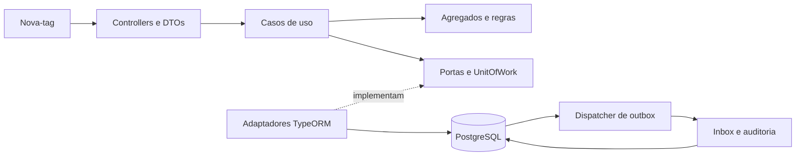

# Arquitetura e decisões

## Contexto de domínio

O bounded context `traceability` representa uma conferência unitária de encomendas.
Pedido, etiqueta e captura compartilham invariantes que precisam de consistência imediata.
Essa proximidade fundamenta um contexto único nesta versão.

## ADR 001 — Domínio e dependências

`Order` encapsula a máquina de estados e o marco de expedição; `Provisioning` encapsula
o ciclo de vínculo e sua estratégia. Etiquetas mantêm identidade estável entre épocas.
Observações, decisões e movimentações são registros imutáveis.

Aplicação e domínio não importam NestJS, TypeORM ou recursos técnicos. O domínio depende
apenas de seu próprio contexto e do shared kernel; a aplicação pode também usar seu domínio.
Controllers dependem dos casos de uso. A composição instala os adaptadores com factories.
As regras de importação são verificadas por ESLint em imports e reexports.

O SOLID é aplicado por responsabilidades pequenas, portas específicas e dependências
injetadas. Não há repositório CRUD genérico nem um serviço único que concentra as regras.
Relógio, identificadores e hash são substituíveis na aplicação.

## ADR 002 — Estado relacional e eventos

O estado corrente está em tabelas relacionais, acompanhado de histórico append-only.
Os eventos internos comunicam fatos já confirmados, como `PedidoCadastrado`,
`EtiquetaRegistrada`, `EtiquetaAtivada`, `VinculoEncerrado`, `MovimentacaoRegistrada`
e `ObservacaoProcessada`. O tipo logístico `COLETA` recebido do app é uma alegação
avaliada antes de produzir qualquer movimentação.

`UnitOfWork` agrupa repositórios e escrita de outbox na mesma transação PostgreSQL.
Nenhum `EntityManager` aparece nas portas da aplicação. A decisão principal é síncrona;
auditoria é o primeiro consumidor assíncrono. Leituras do histórico consultam o registro
autoritativo e não dependem do atraso da auditoria.

| Registro | Responsabilidade |
| --- | --- |
| `orders` | Estado logístico e versão do pedido |
| `tags` | Identidade da etiqueta e UID normalizado |
| `provisionings` | Pedido associado, estratégia, época e ciclo de vida |
| `observations` | Entrada normalizada, fingerprint e recebimento |
| `decisions` | Resultado imutável da avaliação da captura |
| `movements` | Efeitos logísticos aceitos e evento inicial do vínculo |
| `outbox` | Eventos duráveis e estado de entrega |
| `inbox` | Confirmação por consumidor e evento |
| `audit_log` | Trilha dos fatos de domínio |

## ADR 003 — Concorrência e idempotência

O PostgreSQL opera em `READ COMMITTED`. Processamento, ativação e encerramento adquirem
o mesmo bloqueio do pedido; o vínculo é relido depois do bloqueio. O provisionamento
também serializa o UID com advisory lock e atribui a próxima época no servidor.
Índices únicos parciais impedem vínculos simultâneos por etiqueta e pedido.

Capturas usam UUID global. Um advisory lock transacional por UUID arbitra reenvios antes
do bloqueio do pedido. O fingerprint SHA-256 usa JSON canônico da entrada normalizada:
UID em hexadecimal maiúsculo, UUID minúsculo, instante UTC e tecnologias ordenadas sem
repetições. Conteúdo NDEF e bytes em Base64 não são alterados. O mesmo conteúdo recupera
o resultado; conteúdo divergente gera `IDEMPOTENCIA_CONFLITO`.

O vínculo indicado na captura é uma alegação de contexto, não uma autorização. Tentativas
com vínculo desconhecido também são armazenadas, com `pedidoId` e estratégia nulos.
Por isso `observations.provisioning_id` não tem FK. Quando o vínculo existe, a estratégia
sempre vem do cadastro. Não existe fallback para um tratamento mais fraco.

UID e NDEF estático são reutilizáveis em diferentes capturas. A unicidade de UUID não
representa anti-replay da evidência física. As garantias SDM serão implementadas separadamente.

## ADR 004 — Regras logísticas e provisionamento

| Evento | Condição | Efeito |
| --- | --- | --- |
| PROVISIONAMENTO | Ativação pelo fluxo de vínculo | Marco inicial; mantém CADASTRADO |
| COLETA | CADASTRADO | COLETADO |
| RECEBIMENTO | COLETADO | RECEBIDO |
| MOVIMENTACAO | COLETADO ou RECEBIDO | Marco repetível com UUID novo |
| EXPEDICAO | RECEBIDO e ainda não expedido | Marco único; mantém RECEBIDO |
| ENTREGA | RECEBIDO | ENTREGUE, com ou sem expedição |

O vínculo precisa estar ativo para operações capturadas. Enviá-las fora da sequência
preserva a observação sem alterar o estado. O servidor não ordena transições pelo relógio
do aparelho. Histórico ordena por recebimento e UUID para desempate.

Provisionamento começa REGISTRADA, avança para ATIVA após confirmação e termina
DESPROVISIONADA. Novos vínculos exigem pedido CADASTRADO. Encerramento é idempotente,
não redefine o pedido nem remove histórico. Reutilizar uma etiqueta produz nova época;
capturas antigas continuam vinculadas à época original.

A API não lê hardware. `bloqueioConfirmado` é uma declaração; para NDEF também é necessário
confirmar a referência emitida. Nenhuma chave de etiqueta é recebida ou devolvida na v1.

## ADR 005 — Eventos recuperáveis

O dispatcher reivindica eventos com `FOR UPDATE SKIP LOCKED`, token de posse e lease.
Ao entregar, bloqueia novamente a linha e verifica o token para excluir workers antigos.
Inbox, efeito de auditoria e confirmação da outbox usam uma única transação. Falhas fazem
rollback e reagendam a entrega, até cinco tentativas. Também existe recuperação de leases
expirados e reprocessamento explícito de eventos FAILED.

Consumidores desta versão produzem apenas efeitos no mesmo PostgreSQL. Um futuro
consumidor de serviço externo precisará de idempotência no destino; não deve executar
operações externas irreversíveis assumindo que o rollback do banco as desfaz.

## Evolução prevista

Autenticação deverá substituir metadados declarados por identidade verificada na fronteira
HTTP. A v2 adicionará fila mobile, lote com resultado por item e dependências/reconciliação.
A v3 adicionará o perfil SDM definido com o hardware, chaves e controle de evidência por
etiqueta/época/contador. Essas etapas exigem novas decisões e testes; não estão simuladas na v1.
