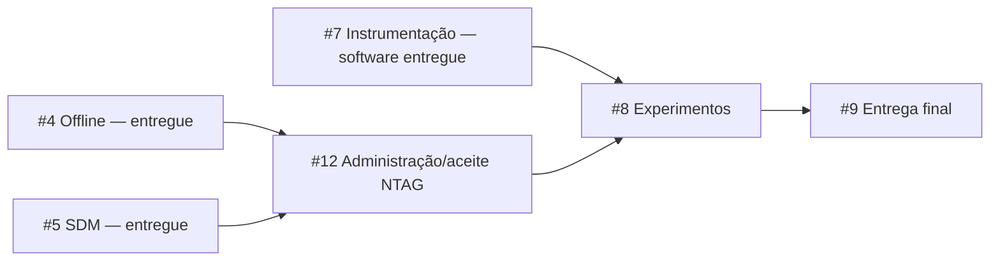

# Entregas publicadas e trabalho restante

Atualização de 7 de outubro de 2026. API:
`codex/issue-12-secure-messaging`, sobre `codex/issue-9-reproducibility`.
Mobile usa `codex/issue-12-secure-messaging`, sobre `codex/issue-9-reproducibility`.
Sem merge na main; publicação/backlog autorizados pelo mantenedor. A revisão do
colega, integração das bases e reprodução final permanecem na #9.

## Software entregue

| Issue | Resultado |
| --- | --- |
| #1 | Sessão NFC exclusiva, Type 4, diagnóstico/bytes originais, perfil SDM candidato |
| #2 | Pedidos, vínculos/épocas, ativação/encerramento, seis eventos e histórico |
| #3 | Login/permissões, autoria separada, SecureStore e revogação/logout |
| #4 | Fila SQLite, cache por API/conta/época, recuperação, lote e Envios |
| #5 | Verificação SDM, vetores NXP/NIST, cofre/épocas, reserva concorrente e políticas |
| #6 | Pendências/prazo, decisões append-only/projeção, consumidor/inbox e reavaliações |
| #7 | Roteiros/ground truth, diário de tentativas/falhas, clocks/fronteiras, JSON/CSV/checksum/integridade/métricas e executor de cenários/reexecução |

A #7 salva tentativa antes do SDK e associa ensaio/captura em uma transação SQLite.
Marcadores controlam liberação da comunicação e identificam censura após reinício.
Exportação usa snapshot read-only e não exporta contas/sessões/chaves. Informações
de cliente/observador são declaradas; não equivalem a prova física automática.

## Trabalho restante

**Preparação da #8 implementada:** protocolo/modelo de ameaça e 13 cenários,
calendário preliminar balanceado, planilha externa de observação vazia e análise
Python reproduzível com tabelas/gráficos, manifesto e contrastes por etiqueta/sessão.
[Guia e limites](../experiments/README.md). Piloto/coleta principal requerem #12 e
protocolo/amostra fixados após o piloto. A #8 continua aberta; dados sintéticos
validam software, sem substituir resultados experimentais.

| Issue | Falta | Dependência para concluir |
| --- | --- | --- |
| [#12](https://github.com/Joao-AugustoPF/nfc-trace-api/issues/12) | API e mobile candidatos: personalização UID/NDEF/SDM, alvo por época, transporte durável, recuperação e ativação em nova RF disponíveis; faltam procedimento/perfil definitivo e aceite NTAG | Bancada no hardware real e reprodução pelo colega |
| [#8](https://github.com/Joao-AugustoPF/nfc-trace-api/issues/8) | Piloto real, protocolo/amostra final, coleta/análise física e validade; preparação de software pronta | #12; instrumentação #7 disponível |
| [#9](https://github.com/Joao-AugustoPF/nfc-trace-api/issues/9) | Integração autorizada, reprodução pelo colega, APK/builds/perfil/corpus definitivos e material final; preparação técnica disponível | #8 e aceites físicos transitivos |

Somente Feiju está disponível. Fixtures sintéticas/reexecuções não concluem NFC
físico, proteção ou coleta comparativa. [Plano #10](https://github.com/Joao-AugustoPF/nfc-trace-api/issues/10)
conserva as dependências nativas e o trabalho agrupado.

## Verificação da #7

- API: 122 testes/11 suítes, PostgreSQL real e Supertest; lint/fronteiras, tipos,
  build/OpenAPI. Cobertura de papel limitado, idempotência, append-only, rollback
  de medidas/estado/outbox, exportação read-only, integridade e CSV seguro.
- Mobile: 241 testes/24 suítes, SQLite real; lint/tipos e bundle iOS local.
  Migração v1→v2, tentativa antes do SDK, timeout/cancelamento, captura/associação
  atômicas, censura após reinício, resposta perdida e isolamento API/conta.
  Arquivos alterados formatados; formatter global ainda aponta 15 arquivos antigos
  fora do escopo, sem erros de lint.
- Executor: 34 cenários/43 roteiros dos três tratamentos em HTTP/PostgreSQL/SQLite
  reais, validador/CSV/reexecução por OPERADOR. Tempos NFC sintéticos são null;
  dataset identifica censuras, sem erros de integridade nem alegação física.
- Nenhum EAS, Actions ou merge iniciado. Workflows manuais e desativados remotamente.

#4 havia exercitado APK Android/SQLite/SecureStore contra API real, com reinício
no modo offline e resposta perdida. #6 verificou reconciliação dos três tratamentos
com fila mobile e consumidores reais. Nesta #7 não houve instalação iOS ou NFC físico.
Development build iOS precisa de SQLite/rede da #4; #5/#6/#7 são JS/TS. Não
remover o app com fila pendente. `.env`, `.tmp`, dados de bancada, tokens/chaves e
builds não entram no Git.

Guias: [instrumentação](experimentation.md), [reconciliação](reconciliation.md),
[SDM/cofre](sdm-validation.md), [offline](offline-synchronization.md),
[integração mobile](mobile-integration.md). Guias antigos preservam seu histórico,
sem substituir este mapa. Publicações anteriores: API #16 sobre #15, Nova-tag #5
sobre #4; integrar na ordem das bases na #9.

## Publicação da instrumentação

- [API #17](https://github.com/Joao-AugustoPF/nfc-trace-api/pull/17), sobre [#16](https://github.com/Joao-AugustoPF/nfc-trace-api/pull/16), implementação `d459a91`.
- [Nova-tag #6](https://github.com/brunoaiolfi/Nova-tag/pull/6), sobre [#5](https://github.com/brunoaiolfi/Nova-tag/pull/5), implementação `e470e92`.

#7 concluída em software. PRs continuam abertos, sem merge; #9 acompanha revisão,
integração e reprodução final. #8 tem protocolo/análise preliminares implementados;
#12 ainda precisa da administração/aceite físico NTAG 424 DNA.

## Verificação da preparação #8

- 27 testes Python: denominadores, falhas/exclusões, ground truth revisado, pendências,
  clock reiniciado, marcadores ausentes, peso igual por etiqueta, pares por sessão,
  limite de bootstrap, integridade e gráficos/manifesto. Dependências em venv local.
- 122 testes API/11 suítes com PostgreSQL real; lint/fronteiras, tipos, build,
  formatter e geração OpenAPI (sem alteração do contrato).
- Calendário candidato: 540 tarefas/54 células, seis ordens balanceadas; nenhum
  UUID físico fabricado e planilha do observador vazia.
- Análise dos 43 roteiros sintéticos #7: 27 artefatos com checksum, zero leituras
  físicas e 129 medidas ausentes/censuradas identificadas. Sem erro de medição;
  intervalos não produzidos para blocos incompletos. Gráficos conferidos localmente.
- Sem nova instalação/build mobile, EAS, Actions ou merge. Workflow continua manual
  e desativado; passos Python só rodarão se alguém habilitar e solicitar execução.

Partes independentes seguintes: reprodução/material técnico #9 e administração NFC
#12. Piloto real/protocolo final/amostra/coleta da #8 continuam pendentes; o piloto
preliminar não fornece inferência ou resultado comparativo do TCC.

Preparação publicada em [API #18](https://github.com/Joao-AugustoPF/nfc-trace-api/pull/18),
sobre [#17](https://github.com/Joao-AugustoPF/nfc-trace-api/pull/17), implementação
`da861f1`. A branch mobile e o PR #6 permanecem iguais. #8/#9/#10/#12 continuam
abertas, com aceite físico e integração final explicitamente pendentes.

## Preparação técnica da #9

[Guia de reprodução](reproduction.md), manifesto candidato API/mobile/APK/dataset,
hashes de fonte/dependências/build carregado (`/health/version`), procedimento de
backup privado/restauração em banco novo e matriz objetivo→software→evidência restante.
Guia e README mobile atualizados; estados anteriores de offline/reconciliação corrigidos.

Verificado localmente: 126 testes API/13 suítes (v1 populada→atual preservando
histórico/épocas/outbox), 241 mobile/24 suítes, lint/tipos/build/formatter; APK Android
0.3.0/3 compilado com bundle embutido, configuração/source hash conferidos.
Reprodução Docker própria com instalação `npm ci`, cinco migrations, seed repetido,
UID/NDEF/seis movimentos/reenvio HTTP, 10 capturas/12 movimentos, backup e restore
de 24 tabelas com hashes idênticos e worker real retomando 34 registros de auditoria.
Após restauração, os dez reenvios retornaram os recibos originais, sem novo efeito;
trigger de imutabilidade e sequência de migrations também foram conferidos.
O APK foi instalado em emulador Android e abriu o login sem Metro, sem erro fatal.
São fixtures HTTP, zero leituras físicas. O cofre externo SDM não foi restaurado
por esse ensaio e não está no dump. Nenhum EAS/Actions/merge iniciado.

A preparação não fecha #9: colega ainda precisa reproduzir versões finais; integração
na main não ocorreu; #12/#8 ainda exigem hardware, procedimentos e resultados.

## Publicação da preparação #9

- [API #19](https://github.com/Joao-AugustoPF/nfc-trace-api/pull/19), sobre [#18](https://github.com/Joao-AugustoPF/nfc-trace-api/pull/18), implementação `6774450`.
- [Nova-tag #7](https://github.com/brunoaiolfi/Nova-tag/pull/7), sobre [#6](https://github.com/brunoaiolfi/Nova-tag/pull/6), implementação `9474d35`.

Build API e APK recompilados após esses commits, sem mudanças rastreadas; manifesto
local confirmou fonte correspondente ao checkout e revisão embutida no APK.
APK 0.3.0/3: SHA-256 `cdf486e69dc56f6d7fe6a451a50b7e79153c8ac20034775640b835b46797425e`.
Log Gradle/manifestos ficam em `.tmp/delivery`, fora do Git; pacote instalado em
emulador, não aceite NFC. A cadeia de PRs segue aberta, sem merge ou Actions/EAS.
Próximo trabalho independente: administração/personalização/secure messaging #12;
NTAG física ainda é necessária para concluir o aceite e o piloto #8.

## Motor de secure messaging da #12

[Protocolo e sequência de integração](ntag-administration.md): AuthenticateEV2First/
NonFirst, MAC/FULL, UID autenticado antes de mutações, permissões recuperáveis,
ChangeKey/CRC, contador e interrupção com efeito físico desconhecido. AES-CMAC é
compartilhado com o verificador SDM. Vetores NXP de autenticação/derivação/IV/CFS/
ChangeKey conferidos; 20 testes novos, 146 API/14 suítes com PostgreSQL/Supertest,
lint/8 fronteiras, tipos, formatter, build e OpenAPI sem alteração de contrato.

O primeiro incremento foi o motor de protocolo, ainda sem endpoint/tela/diário/cofre
naquela ocasião. Inventário, diário e API de inspeção foram acrescentados no incremento
abaixo; o trabalho restante atual está na tabela. Nenhum checkbox de personalização
completa ou bancada foi concluído. Mobile não mudou; nenhum EAS, Actions ou merge iniciado.

Motor publicado em [API #20](https://github.com/Joao-AugustoPF/nfc-trace-api/pull/20),
draft sobre [#19](https://github.com/Joao-AugustoPF/nfc-trace-api/pull/19), implementação
`e07450e`. O PR será ampliado na mesma branch conforme a integração #12 avançar.

## Inventário e inspeção administrativa da #12

No mesmo PR #20/branch: contexto `tag-administration`, cofre AES-GCM dos cinco slots,
importação CLI privada/auditada, plano imutável por vínculo/UID/época, inspeção EV2
autenticando todas as chaves e consultando versões/configurações. API ADMINISTRADOR
com lease/sessão RF, recuperação explícita, diário paginado e checkpoint idempotente.
Sexta migration; seis tabelas novas. Intenção precede emissão, resposta/recibo/comando
seguinte/outbox são atômicos; rollback/reinício descarta canal. Conta/sessão são
revalidadas no banco. Mestras permanecem externas e wrappers anteriores preservados.

Inspeção não grava nem instala chaves; resultado explicita `personalizada:false` e
vínculo permanece REGISTRADA. Somente Feiju disponível, sem teste físico ou alteração
mobile naquele incremento. Material alvo/plano protegido e recuperação de escrita
parcial estão descritos abaixo. Checkboxes de personalização/aceite da #12
continuam abertos, assim como #8/#9. Ver [contrato/procedimento](ntag-administration.md).

Validação local: **166 testes/16 suítes**, PostgreSQL real/Supertest; 17 integrações
novas de inventário/inspeção e três testes de cofre/parser. Incluem CLI real com ACL
Windows (remoção de permissão explícita de terceiros), cinco slots/UID/versões,
reenvio/concorrência, reinício/lease, cancelamento após novo login, revogação,
vínculo encerrado, imutabilidade, rollback de intenção/resposta/canal e schemas
OpenAPI de autenticação/inspeção distintos. Lint/oito
fronteiras, tipos, formatter, build e OpenAPI passaram. Endpoints administrativos
de inspeção documentados; não há endpoint de APDU arbitrária ou chave bruta.

## Personalização recuperável no servidor da #12

Mesmo PR #20/branch: alvo privado imutável dos cinco slots por provisionamento/época;
slots 1/2 SDM usam o material já emitido para a época; demais slots gerados no servidor.
Plano UID/NDEF/SDM com proteção temporária, CC, NLEN zero, gravação em trechos de 80
bytes e conferência FULL. Troca de slot 0 por último, nova autenticação, conferência
de todos os slots/versões e configuração final. Nenhuma ativação por ACK.

Sétima migration: alvo por época, wrappers append-only e checkpoints de alteração
física/prova de conteúdo. API registra intenção antes de emitir mutações; resultado
fica NAO_CONFIRMADA até concluir. Recuperação conserva alvo e exige escolha explícita
ATUAL/ALVO por slot. SDM já aplicado com prova persistida só é conferido, sem reset;
época com evidência não pode receber nova mutação. Vínculo/operação com alteração
pendente não podem ser encerrados, nem ativados. CLI rewrap preserva referências,
histórico/material físico e produz outbox na mesma transação.

Validação local: **186 testes/17 suítes**, PostgreSQL/Supertest, incluindo 20 testes
novos de personalização com PICC sintética: três tratamentos, perda de ACK de escrita,
troca de chave e perfil SDM, reinício, reenvio HTTP, escolha de material, ausência de
prova, contador já reservado, concorrência/alvo único e rollback/outbox/cofre.
Lint/oito fronteiras, tipos, formatter, build/OpenAPI e reprodução local são verificados
antes da publicação. Fixtures não cumprem os checkboxes físicos da #12.

Naquele incremento somente o servidor mudou. A integração mobile está descrita
abaixo. NTAG real, proteção/recuperação físicas e perfil final permanecem pendentes;
nenhum Actions, EAS ou merge. #12/#8/#9 continuam abertas.

## Integração administrativa candidata no Nova-tag

Mobile `7a8f3bb` na mesma branch #12, sobre preparação #9: tela ADMINISTRADOR com
pedido/identificação automática, tratamento/política selecionáveis, confirmação do
plano e progresso persistente. Diário SQLite separado: tentativa confirmada antes
do NFC, resposta completa salva antes do HTTP, recibo/próximo comando atômicos.
Timeout de rede não retransmite APDU. Recuperação HTTP do diário, outra RF com
escolha explícita dos cinco slots, cancelamento/background/blur e resposta tardia.
Ativação por nova leitura, evidência/recibo recuperáveis e encerramento administrativo.
Gerenciar oferece retomada do vínculo NTAG. Feiju conserva o fluxo simples.

Validação mobile: **277 testes/28 suítes**, 36 novos casos administrativos, SQLite
real e adaptador/API/NFC controlados. Inclui reabertura/concorrência/rollback,
falhas de SQLite, resposta HTTP perdida, mudança de login, RF/cancelamento tardio,
recuperação de chave e confirmação da interface. Lint/tipos, formatter dos arquivos
alterados e matriz Expo passaram. Bundle iOS exportado localmente; não é build ou
instalação iOS. APK Android 0.4.0/4 compilado localmente e instalado preservando
dados no emulador: abriu login sem Metro, sem erro fatal. Fonte/revisão embutidas
correspondem ao commit mobile `7a8f3bb`, sem mudanças rastreadas no build.
SHA-256: `615eb322a23e3c0a1b349c43eb48dee2672f6c67b2be87d19c7ce9063d26b53e`.
Logs/manifesto/APK ficam fora do Git. [Nova-tag #8](https://github.com/brunoaiolfi/Nova-tag/pull/8)
é draft sobre #7; API #20 permanece draft sobre #19.
Servidor mantém 186 testes/17 suítes e
sete migrations; este incremento não altera seu código de execução.

[Guia mobile](https://github.com/brunoaiolfi/Nova-tag/blob/codex/issue-12-secure-messaging/docs/16-administracao-ntag.md).
Só há Feiju: zero personalizações NFC físicas nesta entrega. #12/#8/#9 permanecem
abertas e os aceites de instalação/chip/SDK/perfil/piloto não foram substituídos
por mocks, emulador ou vetores públicos. Sem merge, Actions ou EAS.
