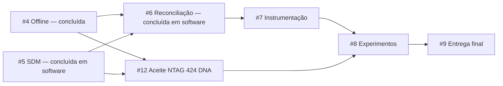

# Entregas publicadas e trabalho restante

Atualização de 7 de outubro de 2026. Branch nos dois repositórios:
`codex/issue-6-event-reconciliation`, baseada em `codex/issue-5-sdm-validation`.
Commits/PRs separados, sem merge na main. Publicação/atualização do backlog foi
autorizada pelo mantenedor; integração final permanece na #9.

## Software entregue

| Issue | Resultado disponível |
| --- | --- |
| [#1](https://github.com/Joao-AugustoPF/nfc-trace-api/issues/1) | Adaptador NFC, sessão exclusiva, timeout/cancelamento, bytes originais, diagnóstico Type 4 e perfil SDM candidato |
| [#2](https://github.com/Joao-AugustoPF/nfc-trace-api/issues/2) | Pedidos, vínculos, ativação, encerramento/nova época, seis eventos, decisões e histórico com API real |
| [#3](https://github.com/Joao-AugustoPF/nfc-trace-api/issues/3) | Login/permissões, autoria separada, restauração/revogação/logout e SecureStore |
| [#4](https://github.com/Joao-AugustoPF/nfc-trace-api/issues/4) | SQLite transacional, cache por API/operador/época, fila persistente, recuperação, lote e aba Envios |
| [#5](https://github.com/Joao-AugustoPF/nfc-trace-api/issues/5) | Parser/verificador SDM, vetores NXP/NIST, chaves cifradas novas por época, ativação criptográfica, reserva/contador concorrente, políticas estrita/tardia, CLI privada/rotação e captura/histórico mobile |
| [#6](https://github.com/Joao-AugustoPF/nfc-trace-api/issues/6) | Pendências com prazo/dependências, decisões append-only/projeção, consumidor com inbox, autorização/época original e UI/histórico de reavaliações |

Critérios de software são conferidos localmente e publicados em branches/PRs.
A aprovação do mantenedor não equivale a revisão independente nem aceite NFC
físico. Fixtures SDM são sintéticas e identificadas. Há somente Feiju disponível.
Personalização, proteção de escrita e mensagens NTAG 424 DNA reais são #12.

## Trabalho restante e dependências

A próxima implementação disponível é **#7**, sem depender de hardware NTAG.
As dependências concluídas #4/#5/#6 permanecem no grafo para rastreabilidade; não
continuam bloqueando o software. Integrar as bases de branches ao assumir.

| Issue | Falta entregar | Dependência pendente para concluir |
| --- | --- | --- |
| [#7](https://github.com/Joao-AugustoPF/nfc-trace-api/issues/7) | Instrumentação, exportação CSV/JSON, integridade e cenários reproduzíveis | Nenhuma issue pendente; integrar contrato #6 |
| [#12](https://github.com/Joao-AugustoPF/nfc-trace-api/issues/12) | Personalização/secure messaging, proteção reversível, recuperação física, perfil definitivo e aceite dos três tratamentos online/offline | Hardware real; implementar administração física restante; #4/#5 entregues |
| [#8](https://github.com/Joao-AugustoPF/nfc-trace-api/issues/8) | Piloto/coleta controlada e análise comparativa dos três tratamentos | #7 + #12; planejamento/scripts podem avançar antes |
| [#9](https://github.com/Joao-AugustoPF/nfc-trace-api/issues/9) | Integração/reprodução final, instalação limpa, versões e material do TCC | #8 |

Não criar issues pequenas para etapas já agrupadas. O
[plano #10](https://github.com/Joao-AugustoPF/nfc-trace-api/issues/10) mantém
sub-issues e dependências nativas. A integração na main/revisão/reprodução
permanece na #9, sem Actions automáticos nesta etapa.

## Verificação atual

- API: 118 testes em 10 suítes, vetores NXP/NIST e PostgreSQL real/Supertest;
  lint/fronteiras, tipos, build e OpenAPI. Nova migration também testada em banco
  PostgreSQL dedicado criado do zero. CLI exportação/rotação/recuperação exercitada.
- Mobile: 232 testes em 23 suítes; SQLite real, resolução/cache SDM sem fallback,
  bytes/época preservados, retry 503 e histórico que distingue autenticação de
  autorização. Lint/tipos e bundle iOS local.
- #4 já havia exercitado APK Android/Expo SQLite/SecureStore contra API real:
  encerramento/reinício offline, reconexão e resposta perdida após commit.
  Nesta #6 não houve novo ensaio NFC físico, instalação iOS ou build EAS.
- Workflows somente `workflow_dispatch` e desativados remotamente. Nenhum Actions,
  merge ou custo de compilação cloud iniciado pela entrega.

O development build iOS precisa dos módulos SQLite/rede adicionados na #4; mudanças
#5/#6 são JS/TS. Desinstalar remove a fila. Guias históricos mantêm datas/resultados
de suas etapas, sem substituir este estado atual. Segredos, arquivos privados,
contas/tokens, `.env`, `.tmp` e builds não entram no Git.

O ensaio #6 fila mobile → HTTP/PostgreSQL → consumidor → consulta → SQLite foi
executado para UID/NDEF/SDM, com reabertura de arquivo, recibo imutável e zero
movimentos duplicados. Mensagens são sintéticas; não é aceite NFC físico.

Veja [reconciliação](reconciliation.md), [SDM e chaves](sdm-validation.md), [offline](offline-synchronization.md) e
[integração do mobile](mobile-integration.md). A #6 reaproveita a reserva
de evidência do UUID original, preserva o recibo de transporte e impede que
registro SDM tardio ganhe movimentação automática.

## Publicação da reconciliação

- [API #16](https://github.com/Joao-AugustoPF/nfc-trace-api/pull/16), sobre [#15](https://github.com/Joao-AugustoPF/nfc-trace-api/pull/15).
- [Nova-tag #5](https://github.com/brunoaiolfi/Nova-tag/pull/5), sobre [#4](https://github.com/brunoaiolfi/Nova-tag/pull/4).

Integrar na ordem das bases; main/revisão/reprodução final permanecem na #9.
