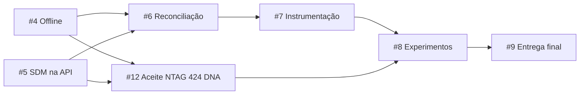

# Entregas publicadas e trabalho restante

Atualização de 6 de outubro de 2026, aprovada pelo mantenedor. A branch de trabalho
nos dois repositórios é `codex/issue-4-durable-offline`.

## Software entregue

| Issue | Resultado disponível |
| --- | --- |
| [#1](https://github.com/Joao-AugustoPF/nfc-trace-api/issues/1) | Adaptador NFC, sessão exclusiva, leitura/gravação UID/NDEF, diagnóstico Type 4/permissões, bytes originais e perfil SDM candidato offline |
| [#2](https://github.com/Joao-AugustoPF/nfc-trace-api/issues/2) | Cliente/API reais, pedidos, busca, provisionamento/ativação, encerramento/nova época, cinco eventos operacionais e histórico/decisões; PROVISIONAMENTO gerado pela ativação |
| [#3](https://github.com/Joao-AugustoPF/nfc-trace-api/issues/3) | Autenticação, autorização, autoria verificada separada das declarações, login/restauração/revogação/logout e SecureStore no Expo |
| [#4](https://github.com/Joao-AugustoPF/nfc-trace-api/issues/4) | SQLite durável, cache de vínculos ativos, recuperação de reinício, fila por operador/API/época, reautenticação, envio recuperável e lote com resultado por item |

O mantenedor aprovou as implementações para publicação. As issues acima registram
o software concluído, com critérios físicos transferidos explicitamente para
[#12](https://github.com/Joao-AugustoPF/nfc-trace-api/issues/12). Aprovação de código
não representa teste de NFC real ou revisão independente do outro integrante.

Os commits são publicados na branch e oferecidos em PRs; não houve merge na main.
A integração dos PRs e o aceite da versão exata de entrega permanecem em #9. Esta
regra de publicação substitui a exigência antiga de aguardar merge para encerrar
as issues de software, conforme autorização do mantenedor nesta atualização.

## Desenvolvimento e aceite físico

A NTAG 424 DNA não bloqueia a implementação de software. #4 está implementada;
#5 é a próxima entrega disponível. #6 e #7 podem avançar depois dos contratos de que
dependem, ainda sem a etiqueta. Em #8 e #9 já é possível preparar protocolo,
análise, instalação e documentação; a coleta física e o aceite final aguardam
o equipamento e as entregas anteriores.

Os campos `Blocked by` abaixo indicam dependências para concluir o escopo
integrado, não proibição de preparar partes independentes. Testes com vetores
oficiais/fixtures identificadas comprovam software; não comprovam NFC físico.

| Issue | Falta entregar | Dependência para concluir |
| --- | --- | --- |
| [#5](https://github.com/Joao-AugustoPF/nfc-trace-api/issues/5) | Verificador SDM na API, referências/versões de chave por época, consumo/contadores concorrentes e políticas estrita/tardia; testes com vetores oficiais | Nenhuma issue pendente; perfil candidato versionado disponível |
| [#6](https://github.com/Joao-AugustoPF/nfc-trace-api/issues/6) | Reavaliação de eventos fora de ordem, decisões versionadas e histórico de pendências | #5 pendente; integrar fila #4 entregue; não depende do aceite físico #12 |
| [#7](https://github.com/Joao-AugustoPF/nfc-trace-api/issues/7) | Instrumentação, CSV/JSON, validação de integridade e cenários reproduzíveis | #6 |
| [#12](https://github.com/Joao-AugustoPF/nfc-trace-api/issues/12) | Personalização autenticada/secure messaging, proteção reversível por chave, recuperação, perfil físico definitivo e aceite NTAG 424 DNA/UID/NDEF/SDM online/offline | #5 e hardware real; integrar fila #4 entregue; implementação administrativa pode começar agora |
| [#8](https://github.com/Joao-AugustoPF/nfc-trace-api/issues/8) | Piloto, coleta controlada e análise dos três tratamentos | #7 e #12; planejamento/scripts podem começar antes |
| [#9](https://github.com/Joao-AugustoPF/nfc-trace-api/issues/9) | Integração/reprodução final, versões identificadas, instalação limpa e material do TCC | #8 |

Não criar issues menores para etapas já incluídas nessas entregas. O
[plano #10](https://github.com/Joao-AugustoPF/nfc-trace-api/issues/10) mantém as
sub-issues e dependências nativas do GitHub.

O aceite de mensagens físicas, escrita protegida, contador observado e fluxo
SDM real fica na #12. A fila #4 não autentica evidência: testes de preservação de
bytes SDM não exigem o verificador #5. A integração entre fila, verificador e
decisões será conferida em #6 e a reprodução física dos três tratamentos em #12.
O perfil candidato usado em #5 deve ter versão fixa; diferenças constatadas na
bancada exigem revisão explícita, sem alterar provisionamentos antigos.

## Verificação desta publicação

- API: 76 testes em 7 suítes, PostgreSQL real/Supertest, lint com 8 verificações
  arquiteturais, tipos, formatação, build e OpenAPI.
- Mobile: 221 testes em 23 suítes, fila testada com SQLite real; lint, tipos e exportação local do bundle iOS.
  O resultado completo e o ensaio nativo estão no guia 11 do Nova-tag.
- Aceite anterior de autenticação: APK Android/SecureStore em emulador contra API
  real, três perfis, restauração, logout, indisponibilidade e revogação.
- Fixtures de protocolo/ponte nativa são identificadas como sintéticas. Somente a
  Feiju está disponível; não houve aceite NTAG 424 DNA ou mensagens físicas SDM.
- Workflows continuam somente `workflow_dispatch` e desativados no GitHub. Não
  executar Actions, build EAS ou merge como consequência desta publicação.

Os guias históricos 05 a 09 no Nova-tag preservam os resultados de cada etapa;
seus antigos estados de issue/branch não substituem esta situação atual. Valores
de chave, contas privadas, tokens, `.env`, `.tmp`, builds e evidências privadas
continuam fora do Git.

A #4 requer atualizar o development build iOS pelos módulos SQLite/rede. Nenhum
build EAS foi iniciado. Cache ativo vale até 24 horas, identidade offline precisa
de verificação anterior/validade, e envio exige autenticação atual na API. A fila
opera em primeiro plano, sem serviço de background. Desinstalar remove dados locais.
Veja [sincronização e limites](offline-synchronization.md).
